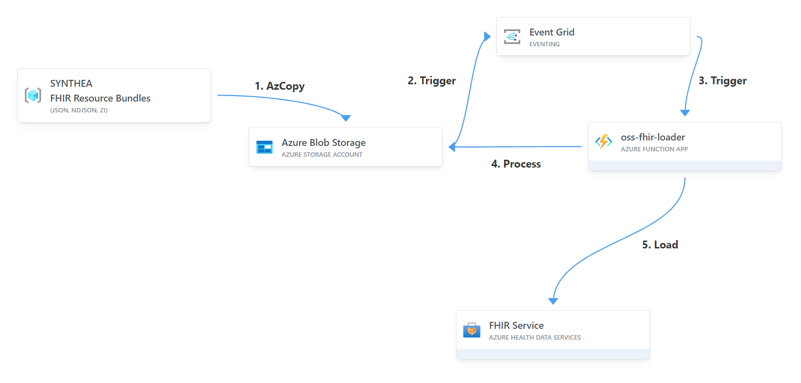
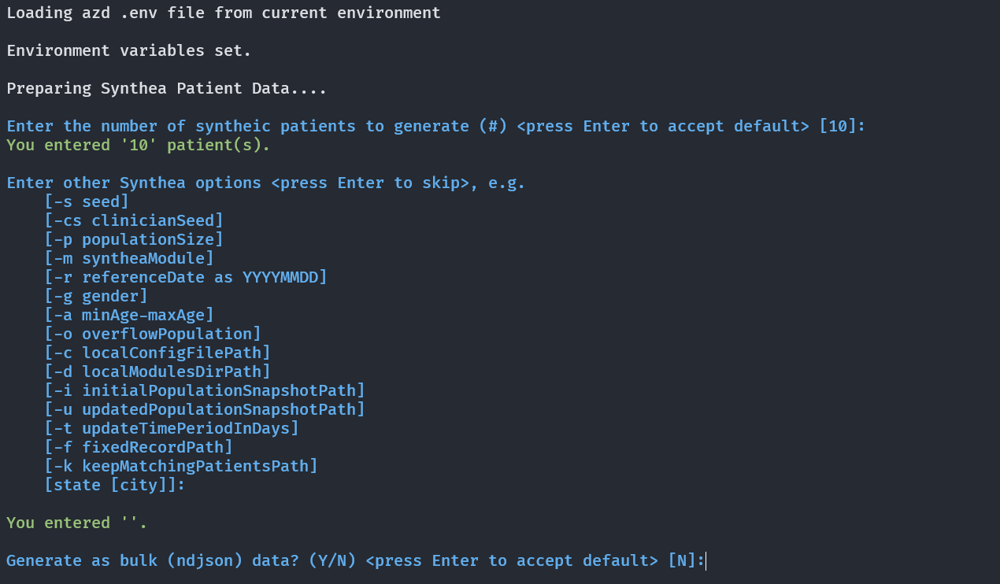

# AHDS FHIR Service with FHIR Bulk Loader

This sample uses the [FHIR Bulk Loader](https://github.com/microsoft/fhir-loader) to seed the Azure Health Data Service FHIR Service with syntheic FHIR Resources.  The FHIR Resources are generated by the [Synthea Patient Data Generator](https://github.com/synthetichealth/synthea?tab=readme-ov-file#syntheatm-patient-generator--) tool and uploaded to the Bulk Loader's Azure Blob Storage using the the AzCopy cmd line tool.  This triggers the Loader Azure function to process and FHIR Resources in Storage and import them to the FHIR Service at scale.  



## Prerequistes
In the addition to the [baseline prerequistes](../README.md#prerequistes-for-all-scenarios), ensure the following are installed: 

* [AzCopy](https://learn.microsoft.com/en-us/azure/storage/common/storage-use-azcopy-v10#download-azcopy) 
    * Once downloaded move the AzCopy commnand to the `/usr/bin/` so it's globally accessible.     
    Example: `sudo cp ./<path-to-azcopy>/azcopy /usr/bin/` 
* The Linux `zip` commnad
    * Once downloaded move the zip command to the `/usr/bin/` so it's globally accessible.          
    Example: `sudo cp ./<path-to-azcopy>/azcopy /usr/bin/` 
* Login to the Azure CLI e.g. `az login`
 
 
## Setting up
1. Open the ingest-with-fhir-loader directory from this repository on your local system.

2. Run the following snippet in your bash terminal to create an Entra ID Service Principal and record the outputs to be used later 
    ```
    # create an Entra ID app
    azCopyAppId=$(az ad app create --display-name "<your-app-name>" --query "appId" -o tsv)

    # create an app secret 
    azCopyAppSecret=$(az ad app credential reset --id $azCopyAppId --display-name "client-secret" --query password -o tsv)

    # create the service principal
    az ad sp create --id $azCopyAppId

    azCopySPNObjectId=$(az ad sp show --id $azCopyAppId --query "id" -o tsv)

    echo "**********************************************"
    echo "azCopySPNObjectId: $azCopySPNObjectId" 
    echo "azCopyAppSecret:   $azCopyAppSecret"
    echo "**********************************************"
    ``` 
3. Create a new azd environment and set it as default.
    ```
    azd env new
    ```

4. Run the below commnand to add the above app secret as an azd env variable to the default environment. 
    ```
    azd env set AZCOPY_SPA_CLIENT_SECRET $azCopyAppSecret
    ```

## Deploy Sandbox
1.  Run the below commmand to deploy the infrastructure and code. 
    ```
    azd up
    ```
2. When prompted enter the above **azCopySPNObjectId** value and enter **Yes** to save the value in the environment for future use.
3. Answer the prompts to seed your FHIR Service with Synthea generated patients using the Bulk Loader.  The following FHIR bundle formats are supported:   
    - FHIR json bundles (*.json)
    - FHIR NDJSON bundles (*.ndjson)
    - Zip compressed bundles (*.zip)

    

<!-- ### AHDS FHIR Service
The AHDS FHIR Service $import endpoint currently only supports FHIR NDJSON bundles.  Ref: https://learn.microsoft.com/en-us/azure/healthcare-apis/fhir/import-data#body. -->
